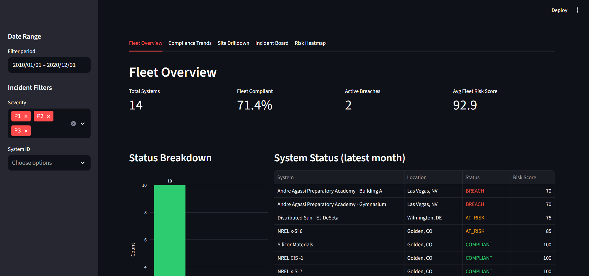
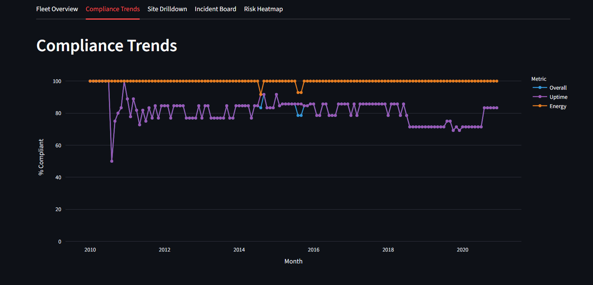
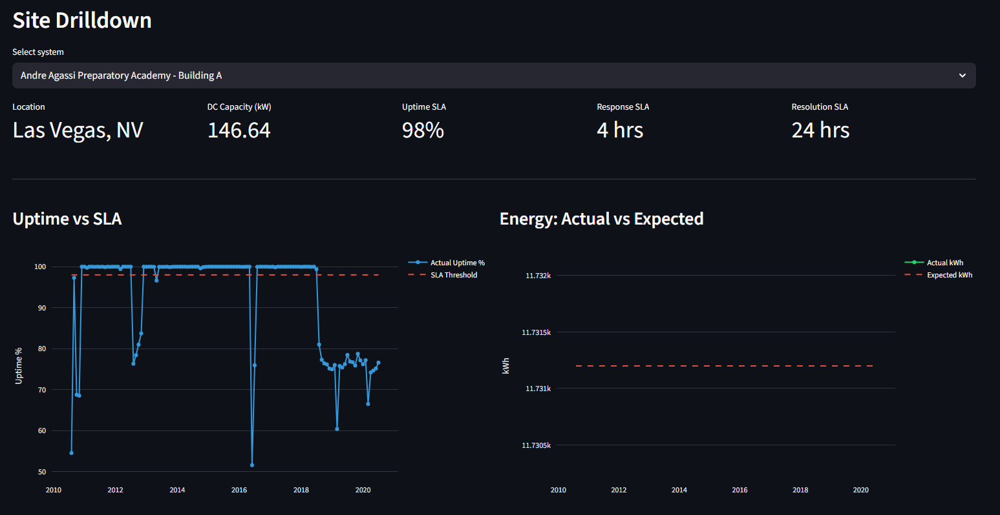
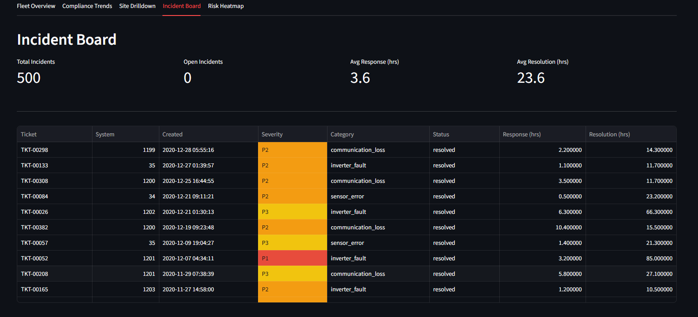
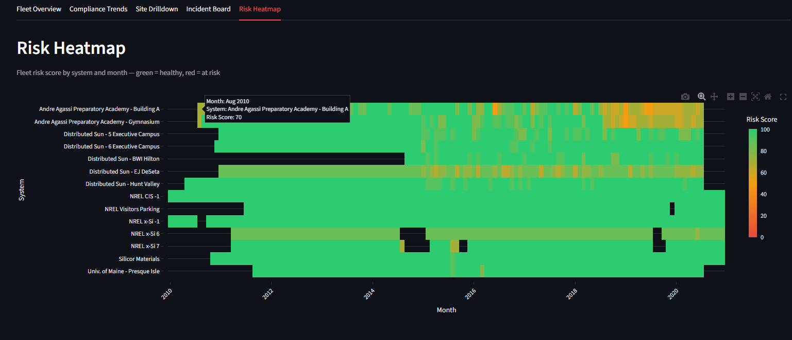

## Overview of the Flag System

I built an end-to-end analytics system that ingests **47M+ rows of real solar telemetry data**, evaluates performance against contractual SLAs, and surfaces operational risks through an interactive dashboard — replicating real-world energy fleet monitoring workflows.

---

## 📊 Dashboard Snapshot

### Fleet Overview

### Compliance Trends

### Site Drilldown

### Incident Board

### Risk Heatmap

---

## Focus: Three Core Questions

### 1. Is the system running?
Every 15 minutes, each solar system reports whether it's online or offline. If a system promised 97% uptime but only achieved 91% in a given month, that's a breach.

### 2. Is it producing enough electricity?
A solar system should generate a predictable amount of energy based on capacity and location. If production drops significantly, it signals issues like degradation, shading, or equipment failure.

### 3. When something breaks, is it fixed fast enough?
Service-level agreements define response and resolution times (e.g., 4 hours response, 24 hours resolution). Incident data tracks how long it takes to respond and whether those targets are met.

---

## What Each Component Does

- **ingest.py**  
Pulls raw telemetry data from NREL for 14 real solar systems (~47M rows across 10 years) and organizes it into a structured format.

- **generate_synthetic.py**  
Creates realistic contract data and service tickets (since real internal systems like Jira are not accessible).

- **transform.py**  
Loads processed data into DuckDB and builds aggregated views like monthly uptime and energy production.

- **compliance.py**  
Core logic layer that compares actual performance against contractual SLAs and assigns a risk score (0–100) for each system.

- **dashboard/app.py**  
Visualizes all outputs into an interactive dashboard for operational decision-making.

---

## Dashboard Walkthrough

### Fleet Overview  
Answers: *“Is anything wrong right now?”*

- Total Systems: 14  
- Fleet Compliant: 71%  
- Active Breaches: 2  
- Avg Risk Score: 93  

---

### Compliance Trends  
Answers: *“Is the fleet improving or degrading over time?”*

- Energy compliance remains ~100% (stable)  
- Uptime fluctuates (~75–85%) → primary issue driver  
- Early volatility due to smaller fleet size  

---

### Location Site Drilldown  
Answers: *“Why is this specific site struggling?”*

- Shows contract terms (SLA thresholds)  
- Uptime vs SLA → breach months visible  
- Energy vs expected production  
- Full incident history  

Enables root cause analysis per site.

---

### Incident Board  
Answers: *“What is the service team doing?”*

- 500 total incidents  
- Avg response: ~3.6 hrs  
- Avg resolution: ~23.6 hrs  

Severity levels:
- P1: critical  
- P2: major  
- P3: minor  

Helps track operational performance and response efficiency.

---

### Risk Heatmap  
Answers: *“Where are the patterns across time and systems?”*

**Key insights:**
- Some sites show recurring degradation  
- Stable systems remain consistently green  
- Patterns reveal long-term operational issues  

---

## How Everything Connects

Each visual was created to provide high-level data to stakeholders, cutting through masses of data, supporting all stakeholders, from executives to service teams.

- **Fleet Overview →** What’s wrong now  
- **Compliance Trends →** Is performance improving  
- **Site Drilldown →** Why a system is failing  
- **Incident Board →** What actions are taken  
- **Risk Heatmap →** Long-term patterns  
